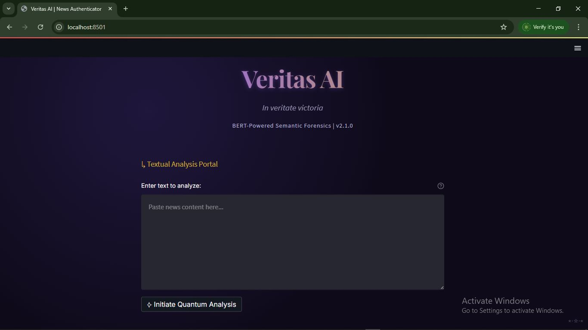
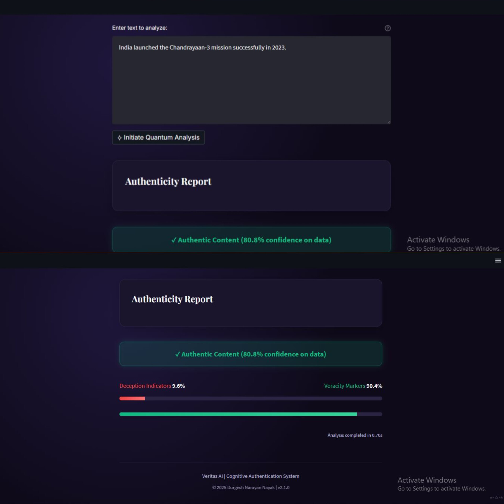
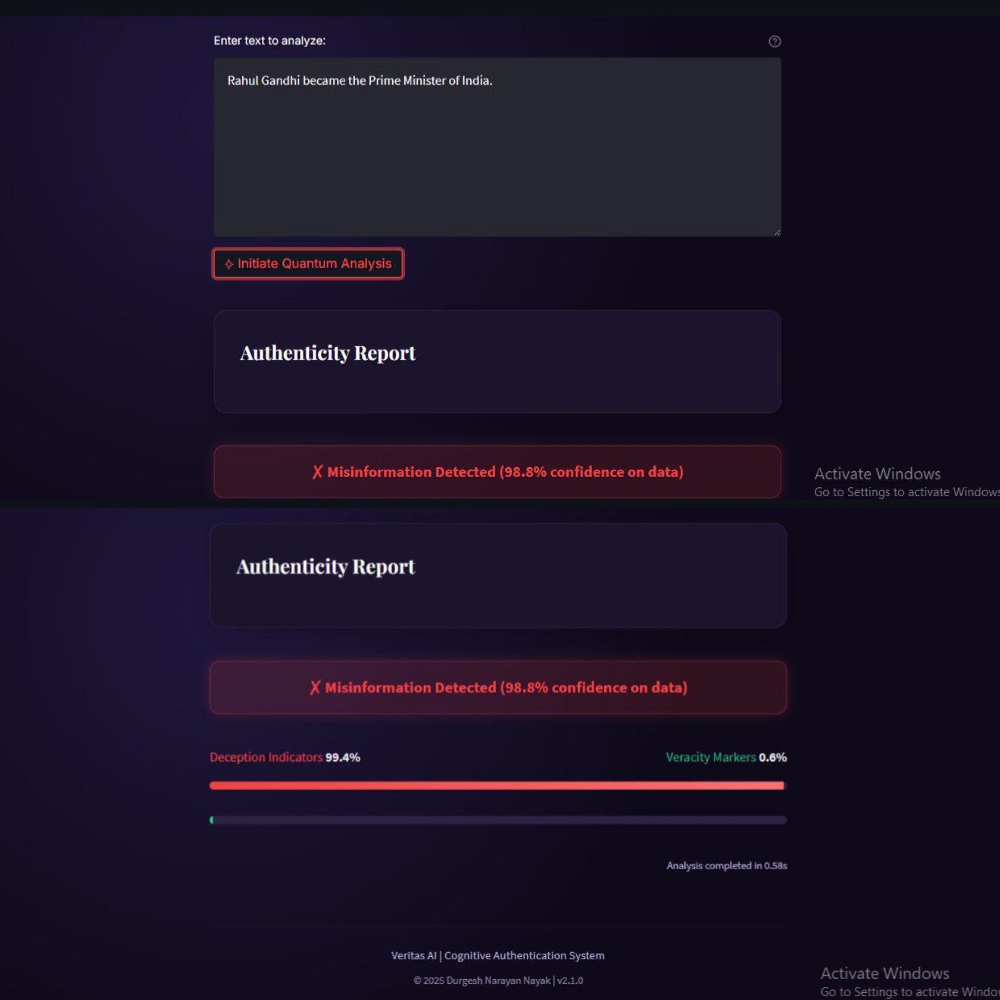

# 📰 Fake News Detector using BERT and Classical ML

A Machine Learning + NLP-based Fake News Detection system that classifies news headlines as **REAL** or **FAKE** using both:
- ✅ A Classical Model (TF-IDF + PassiveAggressiveClassifier)
- ✅ A Transformer Model (BERT fine-tuned for classification)

---

## 📁 Project Overview
<video controls src="InShot_20250630_123434725.mp4" title="Title"></video>

## 📁 Project Structure
- `data/` → raw dataset (not pushed to GitHub)
- `notebooks/` → data cleaning and exploration
- `app.py` → Streamlit frontend
- `model/` → saved ML model

---

## 📌 Features

- Dual model implementation: Classical & BERT
- Real-time prediction via Streamlit app
- Clean UI with model switch support
- Google Colab-compatible training scripts
- Well-organized structure and Git-ready

---

## 📊 Dataset

We use the widely known **"Fake and Real News Dataset"** containing:
- `Fake.csv` – 23,000+ fake news articles
- `True.csv` – 21,000+ real news articles

Both files are stored in the `data/` folder.

---
## TESTED QUESTIONS
 REAL News

Narendra Modi is the current Prime Minister of India.

India launched the Chandrayaan-3 mission successfully in 2023.

The Supreme Court of India is located in New Delhi.

Microsoft acquired LinkedIn in 2016.

COVID-19 vaccines have helped reduce the spread of the virus.

❌ FAKE News 

Aliens have signed a peace treaty with the United Nations.

Narendra Modi resigned and became the president of the USA.

Elon Musk discovered a way to live without food.

Chocolate cures all types of cancer.

Bill Gates banned Windows in India.

 Opinion-Based (Edge Cases)

Rahul Gandhi is more popular than Modi globally.

The Indian economy is going to crash next month.

India is the best country in the world.

Cats are more intelligent than dogs.

The government will declare a national emergency tomorrow.

---

## 🎓 Skills Demonstrated

- Natural Language Processing (NLP)
- Fine-tuning transformer models (BERT)
- Scikit-learn pipelines and feature engineering
- Streamlit UI development
- Google Colab model training
- GitHub project structure and LFS handling

---

## 🎥 Demo

[🔗 Link to Demo Video](https://your-demo-link.com)  
*(Hosted on Google Drive / YouTube)*

---

## 🛠 Tech Stack

- Python
- Scikit-learn
- Pandas, NumPy
- PyTorch
- Hugging Face Transformers
- Streamlit
- Google Colab
- Git + GitHub (with Git LFS)

---

## 🙋‍♂️ Author

**Durgesh Narayan Nayak**  
2nd Year CSE (AI & ML) Student  
[LinkedIn](https://www.linkedin.com/in/durgesh-narayan-nayak-82098a353/)  
[GitHub](https://github.com/DnN04)

---

